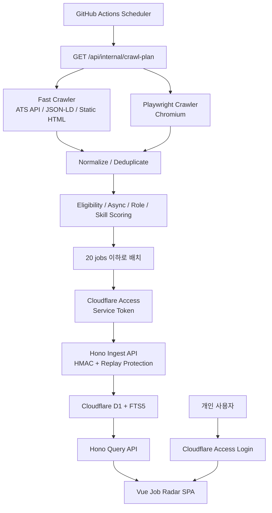

# Remote Job Radar — 월 $0 무료형 MVP 상세 기술 설계

**기준일:** 2026년 8월 13일  
**목적:** Remote·Async-first·Frontend Engineer·Product Engineer·Three.js/WebGL/WebGPU 관련 채용 공고를 개인적으로 수집·분류·관리하는 비공개 웹앱  
**운영비 목표:** 기존 도메인을 보유했다는 전제에서 월 $0에 가깝게 운영  
**사용자:** 1인  
**자동 지원 기능:** 제외  
**수집 대상:** 공식 기업 채용 페이지와 공개 ATS 데이터

---

## 1. 설계 결론

무료형 MVP에서는 다음처럼 역할을 분리하는 것이 가장 안정적이다.

```text
GitHub Actions
  ├─ 외부 사이트 요청
  ├─ HTML·JSON 파싱
  ├─ Playwright 브라우저 실행
  ├─ 정규화
  ├─ 중복 제거
  ├─ Remote·Async·기술스택 판정
  └─ 점수 계산
          ↓
Cloudflare Access
          ↓
Hono Worker
  ├─ 인증
  ├─ HMAC 검증
  ├─ 입력 스키마 검증
  ├─ D1 일괄 UPSERT
  └─ Vue SPA·조회 API 제공
          ↓
Cloudflare D1
```

핵심 원칙은 다음과 같다.

> **CPU 사용량이 큰 일은 GitHub Actions에서 하고, 무료 Worker는 인증·조회·저장만 담당한다.**

Cloudflare Workers Free는 하루 10만 요청을 제공하지만 요청당 CPU 시간이 10ms이고, 외부 subrequest도 요청당 50개로 제한된다. 따라서 Worker에서 대량 HTML 파싱이나 채용 사이트 순회까지 수행하는 구조는 무료형에 적합하지 않다.

---

# 2. 목표와 비목표

## 2.1 목표

앱은 다음 질문에 빠르게 답해야 한다.

```text
새로운 공고인가?
한국 거주자가 지원할 수 있는가?
Worldwide 또는 APAC Remote인가?
Async-first 근무가 명시되어 있는가?
필수 시간대 중첩이 있는가?
Frontend 또는 Product Engineer 성격인가?
Three.js·WebGL·WebGPU·그래픽 관련성이 있는가?
내가 저장·제외·지원한 적이 있는가?
공고 내용이 이전과 달라졌는가?
```

## 2.2 비목표

초기 버전에서는 다음 기능을 넣지 않는다.

```text
LinkedIn·Indeed 로그인 크롤링
캡차 또는 차단 우회
자동 이력서 제출
자동 지원
전체 웹 검색엔진 구축
LLM을 이용한 모든 공고 분석
실시간 알림 인프라
다중 사용자·조직 권한
```

무료형 MVP의 범위는 **관심 기업 100~250개를 감시하는 개인용 채용 레이더**로 제한한다.

---

# 3. 2026년 8월 기준 추천 스택

## 3.1 전체 스택

| 영역 | 선택 |
|---|---|
| 로컬·CI 런타임 | Node.js 24 LTS |
| 패키지 관리 | pnpm + lockfile |
| 프런트엔드 | Vue 3 + Composition API |
| 빌드 | Vite 8.1 |
| 언어 | TypeScript strict |
| 스타일 | Tailwind CSS 4.3 |
| 라우팅 | Vue Router 4 |
| 서버 상태 | TanStack Vue Query 5 |
| 로컬 UI 상태 | Pinia |
| 검증 | Zod 4 |
| API | Hono |
| 호스팅 | Cloudflare Workers Static Assets |
| Worker 개발 | Cloudflare Vite Plugin + Wrangler 4 |
| 데이터베이스 | Cloudflare D1 |
| DB 접근 | Drizzle ORM + 직접 SQL 병용 |
| 전문 검색 | SQLite FTS5 |
| 일반 크롤링 | Node Fetch + Cheerio |
| 브라우저 크롤링 | Playwright Chromium |
| 동시성 제한 | p-limit |
| 해시·서명 | Node Crypto / Web Crypto |
| 단위 테스트 | Vitest |
| Worker 통합 테스트 | Cloudflare Workers 테스트 환경 |
| 브라우저 테스트 | Playwright Test |
| 자동 실행 | GitHub Actions |
| 사용자 인증 | Cloudflare Access |
| CI 인증 | Cloudflare Access Service Token + HMAC |

2026년 8월 13일 현재 Node.js 24는 LTS이고 최신 v24 계열은 24.19.0이다. Vite 8.1은 2026년 6월 공개되었고, Tailwind CSS 4.3은 2026년 5월 공개되었다. Vue의 현재 Quick Start 역시 Vite 기반 SPA 구성을 사용한다.

## 3.2 Vue/Vite를 선택하는 이유

이 앱은 공개 SEO가 필요 없는 개인용 대시보드다. 따라서 SSR 프레임워크보다 Vue SPA가 단순하다.

```text
서버 렌더링 불필요
로그인 후에만 접근
데스크톱 중심
공고 필터와 상세 패널 중심
복잡한 폼보다 데이터 탐색 중심
오프라인 캐시도 선택적으로 적용 가능
```

Cloudflare는 Worker 코드와 정적 파일을 하나의 배포 단위로 올릴 수 있는 Static Assets 방식을 제공한다. 정적 파일 경로가 일치하면 Worker를 호출하지 않고 파일을 제공하며, API와 SPA를 하나의 Worker 프로젝트로 배포할 수 있다.

---

# 4. 물리적 구성

## 4.1 배포 단위

```text
1. Cloudflare Worker 1개
   jobs.example.com

2. Cloudflare D1 데이터베이스 1개
   remote-job-radar-prod

3. GitHub 비공개 저장소 1개
   remote-job-radar

4. GitHub Actions 워크플로 3개
   crawl-fast.yml
   crawl-browser.yml
   deploy.yml

5. Cloudflare Access 애플리케이션 2개
   사용자용 전체 앱
   CI용 내부 API 경로
```

## 4.2 전체 아키텍처



---

# 5. 각 구성요소의 책임

## 5.1 GitHub Actions 크롤러

GitHub Actions는 다음을 수행한다.

```text
수집 대상 조회
HTTP 요청
ETag·Last-Modified 처리
ATS JSON 파싱
JSON-LD 파싱
HTML 파싱
Playwright 실행
본문 텍스트 정리
지원 가능 지역 판정
Async 근무 신호 판정
역할·기술 키워드 추출
점수 계산
content hash 생성
20개 단위 배치 전송
실행 로그·실패 fixture 생성
```

## 5.2 Hono Worker

Worker는 다음만 담당한다.

```text
Cloudflare Access를 통과한 요청 수신
Bearer token 확인
HMAC 서명 검증
timestamp·nonce 검증
Zod 입력 검증
D1 prepared statement 실행
공고 조회·필터·페이지네이션
사용자 액션 저장
SPA 정적 파일 제공
```

Worker에서는 하지 않는 작업:

```text
외부 채용 사이트 순회
Playwright 실행
대규모 HTML 정리
LLM 호출
수백 개 공고의 점수 재계산
```

## 5.3 D1

D1은 다음 데이터의 원본 저장소다.

```text
기업
채용 소스
공고
공고 변경 버전
수집 실행
소스별 성공·실패
저장·제외·지원 상태
수집 배치 idempotency
HMAC nonce
전문 검색 인덱스
```

D1 Free는 하루 500만 행 읽기, 하루 10만 행 쓰기, DB 하나당 500MB, 계정 총 5GB, 무료 계정당 최대 10개 DB를 제공한다. 한 Worker invocation에서 D1 쿼리는 최대 50개이므로, 수집 배치 크기를 이에 맞춰 제한해야 한다.

---

# 6. 저장소 구조

```text
remote-job-radar/
├─ apps/
│  ├─ web/
│  │  ├─ src/
│  │  │  ├─ app/
│  │  │  ├─ components/
│  │  │  ├─ features/
│  │  │  │  ├─ jobs/
│  │  │  │  ├─ companies/
│  │  │  │  ├─ sources/
│  │  │  │  └─ settings/
│  │  │  ├─ pages/
│  │  │  ├─ queries/
│  │  │  ├─ stores/
│  │  │  └─ styles/
│  │  ├─ index.html
│  │  └─ vite.config.ts
│  │
│  ├─ worker/
│  │  ├─ src/
│  │  │  ├─ index.ts
│  │  │  ├─ env.ts
│  │  │  ├─ middleware/
│  │  │  │  ├─ access.ts
│  │  │  │  ├─ bearer.ts
│  │  │  │  ├─ hmac.ts
│  │  │  │  └─ request-id.ts
│  │  │  ├─ routes/
│  │  │  │  ├─ jobs.ts
│  │  │  │  ├─ companies.ts
│  │  │  │  ├─ actions.ts
│  │  │  │  ├─ crawl-plan.ts
│  │  │  │  └─ ingest.ts
│  │  │  ├─ repositories/
│  │  │  └─ services/
│  │  └─ wrangler.jsonc
│  │
│  └─ crawler/
│     ├─ src/
│     │  ├─ cli.ts
│     │  ├─ runners/
│     │  │  ├─ fast-runner.ts
│     │  │  └─ browser-runner.ts
│     │  ├─ adapters/
│     │  │  ├─ greenhouse.ts
│     │  │  ├─ lever.ts
│     │  │  ├─ ashby.ts
│     │  │  ├─ jsonld.ts
│     │  │  ├─ static-html.ts
│     │  │  └─ playwright.ts
│     │  ├─ normalize/
│     │  ├─ classify/
│     │  ├─ scoring/
│     │  ├─ security/
│     │  └─ transport/
│     └─ fixtures/
│
├─ packages/
│  ├─ contracts/
│  │  ├─ ingest.ts
│  │  ├─ job.ts
│  │  └─ source.ts
│  ├─ domain/
│  ├─ db/
│  │  ├─ schema.ts
│  │  └─ migrations/
│  └─ shared/
│
├─ .github/
│  └─ workflows/
│     ├─ crawl-fast.yml
│     ├─ crawl-browser.yml
│     ├─ test.yml
│     └─ deploy.yml
│
├─ pnpm-workspace.yaml
├─ package.json
├─ tsconfig.base.json
└─ pnpm-lock.yaml
```

---

# 7. 패키지 구성

## 7.1 프런트엔드

```text
vue
vue-router
pinia
@tanstack/vue-query
@vueuse/core
zod
tailwindcss
@tailwindcss/vite
lucide-vue-next
```

UI 컴포넌트 라이브러리를 처음부터 크게 도입할 필요는 없다. 필터, 카드, 상세 패널, 다이얼로그 정도를 자체 컴포넌트로 만드는 편이 유지보수하기 쉽다.

## 7.2 Worker

```text
hono
drizzle-orm
zod
@cloudflare/vite-plugin
wrangler
```

Hono는 Web Standard API 기반이며 Cloudflare Workers를 포함한 여러 런타임을 지원한다.

## 7.3 크롤러

```text
playwright
cheerio
p-limit
zod
fast-json-stable-stringify
```

브라우저 크롤러는 Chromium 하나만 설치한다.

```bash
npx playwright install --with-deps chromium
```

Playwright는 각 버전에 대응하는 브라우저 바이너리를 요구하므로, 패키지 버전과 브라우저 설치 버전을 lockfile로 함께 고정한다. CI에서는 브라우저와 시스템 의존성을 `--with-deps`로 설치하는 방식이 공식적으로 안내된다.

---

# 8. 수집 소스 설계

## 8.1 어댑터 우선순위

```text
1. Greenhouse 공개 Job Board API
2. Lever Postings API
3. Ashby 공개 Job Postings API
4. JobPosting JSON-LD
5. 서버 렌더링 HTML
6. Playwright
```

Greenhouse의 공개 GET Job Board API는 인증 없이 사용할 수 있다. Lever는 JSON 형태의 Postings API를 제공하고, Ashby도 현재 공개 중인 직무를 반환하는 Job Postings API를 제공한다.

## 8.2 공통 어댑터 인터페이스

```ts
export interface JobSourceAdapter {
  readonly kind:
    | "greenhouse"
    | "lever"
    | "ashby"
    | "jsonld"
    | "static-html"
    | "playwright";

  fetch(
    source: CrawlSource,
    context: FetchContext,
  ): Promise<FetchResult>;

  parse(
    result: FetchResult,
    source: CrawlSource,
  ): Promise<RawJob[]>;

  normalize(
    raw: RawJob,
    source: CrawlSource,
  ): NormalizedJob;
}
```

## 8.3 소스 설정

기업별 CSS 선택자나 ATS 식별자는 코드가 아니라 DB에 저장한다.

```json
{
  "adapter": "static-html",
  "listSelector": ".job-card",
  "titleSelector": ".job-title",
  "locationSelector": ".job-location",
  "linkSelector": "a",
  "detailDescriptionSelector": ".job-description",
  "browserRequired": false
}
```

이 방식이면 사이트 구조가 바뀌었을 때 코드를 배포하지 않고 설정만 수정할 수 있다.

---

# 9. 수집 실행 흐름

## 9.1 실행 시작

GitHub Action은 먼저 다음 API를 호출한다.

```http
GET /api/internal/crawl-plan?runner=fast&limit=200
```

응답:

```json
{
  "runId": "run_20260813_0017",
  "leaseExpiresAt": 1786561200,
  "sources": [
    {
      "id": "src_example_greenhouse",
      "companyId": "company_example",
      "adapter": "greenhouse",
      "url": "...",
      "adapterKey": "example",
      "etag": "...",
      "lastModified": "...",
      "previousJobCount": 24
    }
  ]
}
```

`crawl-plan`은 다음 조건을 만족하는 소스만 반환한다.

```text
active = true
next_due_at <= 현재 시각
현재 lease가 없거나 만료됨
runner 종류가 일치함
연속 실패로 일시 정지되지 않음
```

수동 실행과 예약 실행이 겹치는 경우를 막기 위해 `lease_owner`와 `lease_until`을 저장한다.

## 9.2 HTTP 수집

권장 설정:

```text
전체 동시 요청             6개
동일 호스트 동시 요청      1개
일반 요청 timeout          20초
브라우저 navigation        30초
selector wait              10초
재시도                     최대 2회
429                        Retry-After 준수
최대 응답 크기             5MB
```

서버가 지원하면 다음 헤더를 사용한다.

```http
If-None-Match: <etag>
If-Modified-Since: <last-modified>
```

## 9.3 파싱

```text
ATS 구조화 필드
    ↓
JSON-LD
    ↓
HTML selector
    ↓
본문 텍스트 규칙
```

`JobPosting` JSON-LD에서는 다음 필드를 우선한다.

```text
title
description
datePosted
validThrough
employmentType
jobLocation
jobLocationType
applicantLocationRequirements
baseSalary
```

Schema.org의 `applicantLocationRequirements`는 원격 직무에 지원할 수 있는 지역을 나타내도록 정의되어 있다.

---

# 10. 정규화 데이터

크롤러는 Worker에 원시 HTML을 보내지 않는다.

```ts
interface NormalizedJob {
  externalId: string;
  canonicalUrl: string;

  title: string;
  companyName: string;
  department: string | null;
  locationText: string | null;
  employmentType: string | null;

  descriptionText: string;
  searchText: string;
  skills: string[];

  workplaceType:
    | "remote"
    | "hybrid"
    | "onsite"
    | "unknown";

  remoteScope:
    | "worldwide"
    | "apac"
    | "country-list"
    | "region-limited"
    | "unknown";

  eligibleFromKorea:
    | "yes"
    | "likely"
    | "unknown"
    | "no";

  asyncLevel:
    | "explicit"
    | "strong"
    | "weak"
    | "synchronous"
    | "unknown";

  requiredTimezone: string | null;
  requiredOverlapHours: number | null;

  salaryCurrency: string | null;
  salaryMin: number | null;
  salaryMax: number | null;
  salaryInterval: string | null;

  postedAt: number | null;
  score: number;
  confidence: number;

  evidence: Evidence[];
  contentHash: string;
}
```

크기 제한:

```text
descriptionText    최대 약 48,000자
searchText         최대 약 12,000자
evidence           최대 12개
evidence 문장       항목당 최대 500자
skills             최대 40개
```

원문 전체가 지나치게 길면 다음 순서로 축약한다.

```text
직무 개요
Responsibilities
Requirements
Remote·Location
Working hours
Compensation
Benefits
```

---

# 11. 개인화 점수 모델

점수는 GitHub Actions에서 계산한다.

## 11.1 기본 100점

| 항목 | 점수 |
|---|---:|
| 한국에서 지원 가능 | 30 |
| Async 근무 적합도 | 25 |
| Frontend/Product 역할 적합도 | 15 |
| Three.js·WebGL·WebGPU 관련성 | 15 |
| 0→1 제품 소유권 | 10 |
| 급여·조건 투명성 | 5 |

## 11.2 감점

```text
US only                    -40
EU/UK 거주 필수            -40
Hybrid 출근 필수           -35
PST 4시간 이상 중첩        -15
매일 실시간 stand-up       -8
빈번한 고객 화상회의       -8
Backend 중심 Product 역할  -10
```

## 11.3 프로필 설정

```yaml
targetProfile:
  roles:
    strong:
      - frontend engineer
      - product engineer
      - graphics engineer
      - creative developer
      - visualization engineer
      - webgl engineer
      - webgpu engineer

  skills:
    strong:
      - three.js
      - webgl
      - webgpu
      - glsl
      - canvas
      - svg
      - pixijs
      - babylon.js
      - visualization

  asyncPositive:
    - async-first
    - asynchronous communication
    - no core hours
    - documentation-first
    - written communication
    - flexible schedule

  asyncNegative:
    - daily stand-up
    - core collaboration hours
    - must overlap
    - frequent zoom calls
```

점수만 저장하지 않고 근거도 함께 저장한다.

```json
{
  "field": "asyncLevel",
  "effect": 12,
  "text": "We default to asynchronous written communication.",
  "source": "job-description"
}
```

---

# 12. GitHub Actions 운영 설계

## 12.1 워크플로 분리

일반 크롤링과 브라우저 크롤링을 분리한다.

```text
crawl-fast.yml
  ATS API
  JSON-LD
  정적 HTML
  하루 4회

crawl-browser.yml
  Playwright 필요 소스만
  하루 1회
```

브라우저를 매번 설치·실행하지 않으므로 Actions 사용 시간을 줄일 수 있다.

## 12.2 일반 크롤러

```yaml
name: Crawl fast sources

on:
  schedule:
    - cron: "17 0,6,12,18 * * *"
  workflow_dispatch:

concurrency:
  group: remote-job-radar-crawl-fast
  cancel-in-progress: false

permissions:
  contents: read

jobs:
  crawl:
    runs-on: ubuntu-latest
    timeout-minutes: 20

    steps:
      - uses: actions/checkout@v6

      - uses: pnpm/action-setup@v4
        with:
          run_install: false

      - uses: actions/setup-node@v6
        with:
          node-version: "24.19.0"
          cache: "pnpm"

      - name: Install
        run: pnpm install --frozen-lockfile

      - name: Crawl
        run: pnpm --filter crawler crawl:fast
        env:
          APP_BASE_URL: ${{ secrets.APP_BASE_URL }}
          CF_ACCESS_CLIENT_ID: ${{ secrets.CF_ACCESS_CLIENT_ID }}
          CF_ACCESS_CLIENT_SECRET: ${{ secrets.CF_ACCESS_CLIENT_SECRET }}
          INGEST_BEARER_TOKEN: ${{ secrets.INGEST_BEARER_TOKEN }}
          INGEST_HMAC_SECRET: ${{ secrets.INGEST_HMAC_SECRET }}

      - name: Upload failure evidence
        if: failure()
        uses: actions/upload-artifact@v4
        with:
          name: crawl-fast-failure
          path: artifacts/
          retention-days: 7
```

GitHub 예약 실행의 cron 기본 시간대는 UTC다. 위 스케줄은 한국 시간으로 대략 다음에 실행된다.

```text
03:17
09:17
15:17
21:17
```

GitHub는 매시 정각 부근에 예약 작업이 지연되거나, 부하가 높으면 일부 작업이 누락될 수 있다고 안내한다. 따라서 `17분`, `43분`처럼 정각을 피하고 `workflow_dispatch`를 항상 함께 둔다.

## 12.3 브라우저 크롤러

```yaml
name: Crawl browser sources

on:
  schedule:
    - cron: "43 18 * * *"
  workflow_dispatch:

concurrency:
  group: remote-job-radar-crawl-browser
  cancel-in-progress: false

permissions:
  contents: read

jobs:
  crawl:
    runs-on: ubuntu-latest
    timeout-minutes: 35

    steps:
      - uses: actions/checkout@v6

      - uses: pnpm/action-setup@v4
        with:
          run_install: false

      - uses: actions/setup-node@v6
        with:
          node-version: "24.19.0"
          cache: "pnpm"

      - run: pnpm install --frozen-lockfile

      - name: Install Chromium
        run: pnpm exec playwright install --with-deps chromium

      - name: Crawl browser sources
        run: pnpm --filter crawler crawl:browser
        env:
          APP_BASE_URL: ${{ secrets.APP_BASE_URL }}
          CF_ACCESS_CLIENT_ID: ${{ secrets.CF_ACCESS_CLIENT_ID }}
          CF_ACCESS_CLIENT_SECRET: ${{ secrets.CF_ACCESS_CLIENT_SECRET }}
          INGEST_BEARER_TOKEN: ${{ secrets.INGEST_BEARER_TOKEN }}
          INGEST_HMAC_SECRET: ${{ secrets.INGEST_HMAC_SECRET }}

      - name: Upload browser evidence
        if: failure()
        uses: actions/upload-artifact@v4
        with:
          name: crawl-browser-failure
          path: artifacts/
          retention-days: 7
```

## 12.4 월간 Actions 사용량 예상

목표 실행 시간을 다음과 같이 잡는다.

```text
일반 수집:
4회 × 30일 × 평균 2분 = 약 240분

브라우저 수집:
1회 × 30일 × 평균 5분 = 약 150분

테스트·배포:
월 약 100~250분

예상 합계:
약 490~640분
```

실제 실행 시간이 두 배로 증가해도 GitHub Free 비공개 저장소의 월 2,000분 범위 안에 들어갈 가능성이 높다. 표준 GitHub-hosted runner는 공개 저장소에서 무료이고, GitHub Free 비공개 저장소에는 월 2,000 Actions 분이 포함된다.

---

# 13. 수집 API 설계

## 13.1 내부 API

```text
GET  /api/internal/crawl-plan
POST /api/internal/ingest
POST /api/internal/source-complete
POST /api/internal/run-complete
POST /api/internal/run-failed
```

## 13.2 배치 크기

한 요청에 최대 20개 공고만 전송한다.

이유:

```text
D1 Free는 Worker invocation당 최대 50 queries
공고 1개당 jobs UPSERT 1회
공고 1개당 job_versions INSERT OR IGNORE 1회
20개 공고 = 약 40 queries
nonce·batch·run 관련 쿼리 포함 시 약 43~47 queries
```

FTS 갱신은 DB trigger로 처리하여 별도 Worker 쿼리를 사용하지 않는다.

## 13.3 요청 헤더

```http
POST /api/internal/ingest
Content-Type: application/json

CF-Access-Client-Id: <access-client-id>
CF-Access-Client-Secret: <access-client-secret>

Authorization: Bearer <ingest-token>
X-Timestamp: 1786579200
X-Nonce: 9de4c6f2-5191-4c54-92bd-e4772dfe4a55
X-Body-SHA256: <hex>
X-Signature: <base64url-hmac>
X-Idempotency-Key: <batch-id>
```

각 계층의 역할:

| 계층 | 역할 |
|---|---|
| Access Service Token | 인터넷 경계에서 CI 요청만 허용 |
| Bearer Token | 앱 내부 수집 권한과 간단한 키 폐기 |
| HMAC | 본문 변조 방지 |
| Timestamp | 오래된 요청 차단 |
| Nonce | 재전송 공격 차단 |
| Idempotency Key | 네트워크 재시도로 인한 중복 저장 차단 |

Cloudflare Access의 Service Token은 Client ID와 Client Secret으로 구성되며, 자동화 시스템은 `CF-Access-Client-Id`와 `CF-Access-Client-Secret` 헤더를 사용해 Access로 보호된 앱에 접근할 수 있다.

---

# 14. HMAC 규격

## 14.1 서명 대상 문자열

```text
POST
/api/internal/ingest
{timestamp}
{nonce}
{bodySha256}
```

즉:

```ts
const canonical = [
  method.toUpperCase(),
  pathname,
  timestamp,
  nonce,
  bodyHash,
].join("\n");
```

## 14.2 GitHub Actions 측 서명

```ts
import {
  createHash,
  createHmac,
  randomUUID,
} from "node:crypto";

export function signIngestRequest(
  body: string,
  secret: string,
) {
  const timestamp = Math.floor(Date.now() / 1000).toString();
  const nonce = randomUUID();

  const bodyHash = createHash("sha256")
    .update(body, "utf8")
    .digest("hex");

  const canonical = [
    "POST",
    "/api/internal/ingest",
    timestamp,
    nonce,
    bodyHash,
  ].join("\n");

  const signature = createHmac("sha256", secret)
    .update(canonical, "utf8")
    .digest("base64url");

  return {
    timestamp,
    nonce,
    bodyHash,
    signature,
  };
}
```

## 14.3 Worker 검증 순서

```text
1. Content-Type 확인
2. Content-Length 상한 확인
3. body를 ArrayBuffer로 읽음
4. SHA-256 재계산
5. X-Body-SHA256과 비교
6. timestamp가 현재 시각 ±300초인지 확인
7. nonce INSERT 시도
8. 이미 존재하는 nonce면 409
9. Web Crypto로 HMAC 검증
10. Bearer token 검증
11. Zod schema 검증
12. idempotency key 확인
13. D1 batch 실행
```

Worker에서는 HMAC 문자열을 직접 비교하기보다 Web Crypto의 `verify()`를 사용한다.

```ts
async function verifyHmac(
  secret: string,
  canonical: string,
  signature: Uint8Array,
): Promise<boolean> {
  const encoder = new TextEncoder();

  const key = await crypto.subtle.importKey(
    "raw",
    encoder.encode(secret),
    {
      name: "HMAC",
      hash: "SHA-256",
    },
    false,
    ["verify"],
  );

  return crypto.subtle.verify(
    "HMAC",
    key,
    signature,
    encoder.encode(canonical),
  );
}
```

---

# 15. Ingest payload

```json
{
  "schemaVersion": 1,
  "runId": "run_20260813_0017",
  "sourceId": "src_example",
  "batchId": "run_20260813_0017-src_example-0001",
  "sequence": 1,
  "totalBatches": 2,
  "fetchedAt": 1786579200,
  "jobs": [
    {
      "externalId": "12345",
      "canonicalUrl": "...",
      "title": "Frontend Engineer",
      "companyName": "Example",
      "department": "Engineering",
      "locationText": "Remote",
      "employmentType": "Full-time",
      "descriptionText": "...",
      "searchText": "...",
      "skills": [
        "TypeScript",
        "Three.js",
        "WebGL"
      ],
      "workplaceType": "remote",
      "remoteScope": "worldwide",
      "eligibleFromKorea": "yes",
      "asyncLevel": "strong",
      "requiredTimezone": null,
      "requiredOverlapHours": null,
      "postedAt": 1786492800,
      "score": 91,
      "confidence": 0.88,
      "evidence": [
        {
          "field": "asyncLevel",
          "effect": 12,
          "text": "We default to asynchronous written communication.",
          "source": "job-description"
        }
      ],
      "contentHash": "..."
    }
  ]
}
```

최대 요청 크기는 약 512KB로 제한한다. 20개 공고가 이를 넘는 경우 크롤러가 더 작은 배치로 분할한다.

---

# 16. 소스 완료 프로토콜

모든 공고 배치가 성공했다고 바로 마감 판정을 수행하면 안 된다.

크롤러가 소스 전체를 정상적으로 처리한 뒤 별도 요청을 보낸다.

```http
POST /api/internal/source-complete
```

```json
{
  "runId": "run_20260813_0017",
  "sourceId": "src_example",
  "status": "healthy",
  "httpStatus": 200,
  "fetchedJobCount": 24,
  "previousJobCount": 25,
  "receivedBatchCount": 2,
  "expectedBatchCount": 2,
  "responseHash": "...",
  "etag": "...",
  "lastModified": "..."
}
```

Worker는 다음 조건을 모두 만족할 때만 해당 소스를 완료 처리한다.

```text
모든 batchId가 저장됨
expectedBatchCount와 실제 batch 수가 같음
소스 fetch가 성공함
파서 필수 필드가 정상임
공고 수가 비정상적으로 감소하지 않음
로그인·캡차 페이지가 아님
```

---

# 17. 오마감 방지

## 17.1 이상 징후

다음 중 하나이면 소스를 `quarantined`로 처리한다.

```text
이전 공고가 5개 이상인데 이번 결과가 0개
공고 수가 한 번에 80% 이상 감소
HTTP 403·429·5xx
본문이 로그인 페이지
캡차 텍스트 발견
필수 selector 미발견
응답이 지나치게 짧음
JSON schema가 예상과 다름
모든 title이 비어 있음
```

이 경우:

```text
기존 공고를 마감하지 않음
missing_count를 증가시키지 않음
source health에 오류 기록
다음 실행 간격을 늘림
UI에 빨간 상태 표시
```

## 17.2 정상 실행 시

공고 UPSERT 시:

```text
last_seen_run_id = 현재 runId
last_seen_at = 현재 시각
missing_count = 0
status = open
```

소스 완료 시, 이번 run에서 보이지 않은 공고:

```text
missing_count += 1
```

두 번 연속 정상 수집에서 보이지 않을 때만:

```text
status = closed
closed_at = 현재 시각
```

이 방식은 일시적인 네트워크 오류나 파서 실패로 공고 전체가 마감되는 문제를 방지한다.

---

# 18. D1 데이터 모델

## 18.1 핵심 스키마

```sql
CREATE TABLE companies (
  id TEXT PRIMARY KEY,
  slug TEXT NOT NULL UNIQUE,
  name TEXT NOT NULL,
  careers_url TEXT,
  remote_policy_url TEXT,
  priority INTEGER NOT NULL DEFAULT 50,
  active INTEGER NOT NULL DEFAULT 1,
  created_at INTEGER NOT NULL,
  updated_at INTEGER NOT NULL
);

CREATE TABLE sources (
  id TEXT PRIMARY KEY,
  company_id TEXT NOT NULL
    REFERENCES companies(id) ON DELETE CASCADE,

  kind TEXT NOT NULL,
  url TEXT NOT NULL,
  adapter_key TEXT,
  config_json TEXT NOT NULL DEFAULT '{}',

  browser_required INTEGER NOT NULL DEFAULT 0,
  crawl_interval_minutes INTEGER NOT NULL DEFAULT 360,

  etag TEXT,
  last_modified TEXT,

  previous_job_count INTEGER NOT NULL DEFAULT 0,
  consecutive_failures INTEGER NOT NULL DEFAULT 0,

  last_success_at INTEGER,
  last_failure_at INTEGER,
  next_due_at INTEGER NOT NULL,

  lease_owner TEXT,
  lease_until INTEGER,

  status TEXT NOT NULL DEFAULT 'active',
  created_at INTEGER NOT NULL,
  updated_at INTEGER NOT NULL
);

CREATE TABLE crawl_runs (
  id TEXT PRIMARY KEY,
  runner_type TEXT NOT NULL,
  trigger_type TEXT NOT NULL,
  github_run_id TEXT,

  planned_source_count INTEGER NOT NULL DEFAULT 0,
  completed_source_count INTEGER NOT NULL DEFAULT 0,
  failed_source_count INTEGER NOT NULL DEFAULT 0,

  started_at INTEGER NOT NULL,
  completed_at INTEGER,
  status TEXT NOT NULL
);

CREATE TABLE source_runs (
  id TEXT PRIMARY KEY,
  run_id TEXT NOT NULL
    REFERENCES crawl_runs(id) ON DELETE CASCADE,
  source_id TEXT NOT NULL
    REFERENCES sources(id) ON DELETE CASCADE,

  status TEXT NOT NULL,
  http_status INTEGER,
  fetched_job_count INTEGER,
  previous_job_count INTEGER,
  response_hash TEXT,

  error_code TEXT,
  error_message TEXT,

  started_at INTEGER NOT NULL,
  completed_at INTEGER
);

CREATE TABLE jobs (
  id TEXT PRIMARY KEY,

  source_id TEXT NOT NULL
    REFERENCES sources(id) ON DELETE CASCADE,
  company_id TEXT NOT NULL
    REFERENCES companies(id) ON DELETE CASCADE,

  external_id TEXT NOT NULL,
  dedupe_key TEXT NOT NULL,
  canonical_url TEXT NOT NULL,

  title TEXT NOT NULL,
  company_name TEXT NOT NULL,
  department TEXT,
  location_text TEXT,
  employment_type TEXT,

  description_text TEXT NOT NULL,
  search_text TEXT NOT NULL,
  skills_text TEXT NOT NULL DEFAULT '',

  workplace_type TEXT NOT NULL DEFAULT 'unknown',
  remote_scope TEXT NOT NULL DEFAULT 'unknown',
  eligible_from_korea TEXT NOT NULL DEFAULT 'unknown',
  async_level TEXT NOT NULL DEFAULT 'unknown',

  required_timezone TEXT,
  required_overlap_hours REAL,

  salary_currency TEXT,
  salary_min REAL,
  salary_max REAL,
  salary_interval TEXT,

  posted_at INTEGER,
  first_seen_at INTEGER NOT NULL,
  last_seen_at INTEGER NOT NULL,
  last_seen_run_id TEXT,

  missing_count INTEGER NOT NULL DEFAULT 0,
  status TEXT NOT NULL DEFAULT 'open',
  closed_at INTEGER,

  score INTEGER NOT NULL DEFAULT 0,
  confidence REAL NOT NULL DEFAULT 0,
  evidence_json TEXT NOT NULL DEFAULT '[]',

  content_hash TEXT NOT NULL,
  created_at INTEGER NOT NULL,
  updated_at INTEGER NOT NULL,

  UNIQUE(source_id, external_id)
);

CREATE TABLE job_versions (
  job_id TEXT NOT NULL
    REFERENCES jobs(id) ON DELETE CASCADE,

  content_hash TEXT NOT NULL,
  snapshot_json TEXT NOT NULL,
  observed_at INTEGER NOT NULL,

  PRIMARY KEY(job_id, content_hash)
);

CREATE TABLE job_actions (
  job_id TEXT PRIMARY KEY
    REFERENCES jobs(id) ON DELETE CASCADE,

  action TEXT NOT NULL,
  dismiss_reason TEXT,
  notes TEXT,

  applied_at INTEGER,
  updated_at INTEGER NOT NULL
);

CREATE TABLE ingest_batches (
  batch_id TEXT PRIMARY KEY,
  run_id TEXT NOT NULL,
  source_id TEXT NOT NULL,
  job_count INTEGER NOT NULL,
  received_at INTEGER NOT NULL
);

CREATE TABLE ingest_nonces (
  nonce TEXT PRIMARY KEY,
  used_at INTEGER NOT NULL
);
```

## 18.2 인덱스

```sql
CREATE INDEX idx_sources_due
ON sources(status, next_due_at);

CREATE INDEX idx_jobs_inbox
ON jobs(status, score DESC, first_seen_at DESC);

CREATE INDEX idx_jobs_company
ON jobs(company_id, status, score DESC);

CREATE INDEX idx_jobs_source_seen
ON jobs(source_id, last_seen_run_id, status);

CREATE INDEX idx_jobs_remote
ON jobs(eligible_from_korea, remote_scope, score DESC);

CREATE INDEX idx_source_runs_health
ON source_runs(source_id, started_at DESC);

CREATE INDEX idx_job_versions_recent
ON job_versions(job_id, observed_at DESC);

CREATE INDEX idx_nonces_used_at
ON ingest_nonces(used_at);
```

D1은 SQLite FTS5와 JSON 함수를 지원한다.

---

# 19. FTS5 검색

## 19.1 FTS 테이블

```sql
CREATE VIRTUAL TABLE jobs_fts USING fts5(
  title,
  company_name,
  location_text,
  skills_text,
  search_text,
  content = 'jobs',
  content_rowid = 'rowid',
  tokenize = 'unicode61'
);
```

## 19.2 동기화 trigger

```sql
CREATE TRIGGER jobs_fts_insert
AFTER INSERT ON jobs
BEGIN
  INSERT INTO jobs_fts(
    rowid,
    title,
    company_name,
    location_text,
    skills_text,
    search_text
  )
  VALUES (
    new.rowid,
    new.title,
    new.company_name,
    new.location_text,
    new.skills_text,
    new.search_text
  );
END;

CREATE TRIGGER jobs_fts_delete
AFTER DELETE ON jobs
BEGIN
  INSERT INTO jobs_fts(
    jobs_fts,
    rowid,
    title,
    company_name,
    location_text,
    skills_text,
    search_text
  )
  VALUES (
    'delete',
    old.rowid,
    old.title,
    old.company_name,
    old.location_text,
    old.skills_text,
    old.search_text
  );
END;

CREATE TRIGGER jobs_fts_update
AFTER UPDATE ON jobs
BEGIN
  INSERT INTO jobs_fts(
    jobs_fts,
    rowid,
    title,
    company_name,
    location_text,
    skills_text,
    search_text
  )
  VALUES (
    'delete',
    old.rowid,
    old.title,
    old.company_name,
    old.location_text,
    old.skills_text,
    old.search_text
  );

  INSERT INTO jobs_fts(
    rowid,
    title,
    company_name,
    location_text,
    skills_text,
    search_text
  )
  VALUES (
    new.rowid,
    new.title,
    new.company_name,
    new.location_text,
    new.skills_text,
    new.search_text
  );
END;
```

## 19.3 검색 예

```sql
SELECT
  jobs.id,
  jobs.title,
  jobs.company_name,
  jobs.location_text,
  jobs.score
FROM jobs_fts
JOIN jobs ON jobs.rowid = jobs_fts.rowid
WHERE jobs_fts MATCH ?
  AND jobs.status = 'open'
ORDER BY jobs.score DESC
LIMIT 50;
```

검색어:

```text
"three.js" OR webgl OR webgpu OR glsl
```

---

# 20. 저장 공간 관리

무료 DB 하나의 한도가 500MB이므로 원시 HTML과 무제한 변경 이력을 저장하면 안 된다.

권장 보존 정책:

```text
현재 공고 description        유지
원시 HTML                    저장하지 않음
job_versions                 공고당 최근 3개
closed 공고                  180일
source_runs                  30일
crawl_runs                   90일
ingest_nonces                24시간
실패 HTML·스크린샷           GitHub artifact 7일
```

예상 규모:

```text
활성·최근 공고 8,000개
공고당 현재 텍스트 평균 15KB
본문 약 120MB
FTS·인덱스·메타데이터 추가
약 200~350MB 목표
```

DB 사용량이 350MB를 넘기기 시작하면 다음 순서로 정리한다.

```text
오래된 source_runs 삭제
오래된 crawl_runs 삭제
job_versions 축소
180일 이상 closed 공고 삭제
FTS search_text 길이 축소
```

---

# 21. 사용자용 API

```text
GET    /api/jobs
GET    /api/jobs/:id
GET    /api/jobs/:id/versions

PATCH  /api/jobs/:id/action
DELETE /api/jobs/:id/action

GET    /api/companies
POST   /api/companies
PATCH  /api/companies/:id

GET    /api/sources
POST   /api/sources
PATCH  /api/sources/:id

POST   /api/sources/:id/test
POST   /api/sources/:id/reset-health

GET    /api/health
GET    /api/dashboard
```

## 21.1 공고 검색

```http
GET /api/jobs
  ?status=open
  &minScore=75
  &eligibility=yes,likely
  &role=frontend,product
  &skills=threejs,webgl,webgpu
  &async=explicit,strong
  &cursor=...
  &limit=50
```

응답은 offset이 아니라 cursor 기반으로 만든다.

```json
{
  "items": [],
  "nextCursor": "score:82:firstSeen:1786579200:id:job_123"
}
```

---

# 22. Vue UI 구조

## 22.1 데스크톱 기본 화면

```text
┌──────────────┬────────────────────────┬─────────────────────────┐
│ 필터·뷰      │ 공고 목록              │ 상세·근거·메모          │
│              │                        │                         │
│ New          │ Frontend Engineer      │ 지원 가능: 높음         │
│ Top Matches  │ Example Company        │ Async: strong           │
│ Three.js     │ 91점                   │ Worldwide               │
│ Product      │ Worldwide · Async      │ Three.js / WebGL         │
│ APAC         │                        │                         │
└──────────────┴────────────────────────┴─────────────────────────┘
```

## 22.2 저장 뷰

```text
새 공고
85점 이상
Worldwide Async
APAC Remote
Three.js·Graphics
Frontend Engineer
Product Engineer
판정 불명
내용 변경
저장한 공고
지원한 공고
```

## 22.3 상세 패널

```text
지원 가능 지역
Remote 범위
시간대 요구
Async 근거
동기식 위험 신호
기술스택
급여 범위
직무 요약
원문 링크
내용 변경 이력
개인 메모
```

점수 설명 예:

```text
+30  Worldwide 지원 가능
+20  Async-first 명시
+15  Frontend Engineer
+15  Three.js·WebGL
+8   0→1 제품 소유권
+4   급여 공개
-5   주 2회 정기 실시간 회의
────────────────────
87점
```

---

# 23. Cloudflare Access 설계

## 23.1 사용자 앱

```text
Application:
jobs.example.com/*

Policy:
Allow

Include:
본인 이메일 주소만

Authentication:
One-time PIN 또는 연결된 IdP
```

## 23.2 CI 내부 API

더 구체적인 경로에 별도 Access 앱을 만든다.

```text
Application:
jobs.example.com/api/internal/*

Policy action:
Service Auth

Include:
remote-job-radar GitHub Actions Service Token
```

Cloudflare Access는 도메인 전체뿐 아니라 특정 path 단위로 보호할 수 있다. Zero Trust의 여러 기능은 최대 50명까지 무료로 사용할 수 있어 1인용 앱에는 충분하다.

## 23.3 직접 접근 차단

Custom Domain을 사용하고 `workers.dev` 주소를 비활성화한다.

```json
{
  "workers_dev": false
}
```

이렇게 해야 Access가 적용되지 않은 `workers.dev` 주소로 직접 접근하는 우회 경로가 생기지 않는다.

---

# 24. Wrangler 설정

```json
{
  "$schema": "../../node_modules/wrangler/config-schema.json",
  "name": "remote-job-radar",
  "main": "src/index.ts",
  "compatibility_date": "2026-08-13",
  "workers_dev": false,

  "assets": {
    "binding": "ASSETS",
    "not_found_handling": "single-page-application"
  },

  "d1_databases": [
    {
      "binding": "DB",
      "database_name": "remote-job-radar-prod",
      "database_id": "<D1_DATABASE_ID>",
      "migrations_dir": "../../packages/db/migrations"
    }
  ],

  "observability": {
    "enabled": true
  }
}
```

Cloudflare Vite Plugin을 사용하면 클라이언트 빌드 결과를 기반으로 Static Assets 디렉터리가 생성되므로 입력 설정에서 경로를 직접 지정하지 않아도 된다. SPA에는 `not_found_handling: "single-page-application"`을 사용할 수 있다.

---

# 25. Hono 라우팅

```ts
import { Hono } from "hono";

type Bindings = {
  DB: D1Database;
  ASSETS: Fetcher;
  INGEST_BEARER_TOKEN: string;
  INGEST_HMAC_SECRET: string;
};

const app = new Hono<{ Bindings: Bindings }>();

app.get("/api/health", (c) => {
  return c.json({
    ok: true,
    version: "1",
  });
});

app.route("/api/jobs", jobsRoutes);
app.route("/api/companies", companyRoutes);
app.route("/api/sources", sourceRoutes);

app.route("/api/internal", internalRoutes);

app.all("*", async (c) => {
  return c.env.ASSETS.fetch(c.req.raw);
});

export default app;
```

---

# 26. 비밀정보 관리

Cloudflare Worker secrets:

```text
INGEST_BEARER_TOKEN
INGEST_HMAC_SECRET
ACCESS_AUD
```

GitHub Actions secrets:

```text
APP_BASE_URL
CF_ACCESS_CLIENT_ID
CF_ACCESS_CLIENT_SECRET
INGEST_BEARER_TOKEN
INGEST_HMAC_SECRET
CLOUDFLARE_API_TOKEN
CLOUDFLARE_ACCOUNT_ID
```

Cloudflare는 API 키와 토큰 같은 민감한 값을 일반 환경변수가 아니라 Secret으로 저장하도록 안내한다. Secret 값은 설정 후 Wrangler와 대시보드에서 다시 노출되지 않는다.

권장 회전 주기:

```text
Access Service Token   6~12개월
Bearer Token           6개월
HMAC Secret            6개월
Cloudflare deploy token 필요 시 또는 연 1회
```

HMAC 회전을 위해 Worker가 잠시 두 개의 키를 받을 수 있도록 한다.

```text
INGEST_HMAC_SECRET_CURRENT
INGEST_HMAC_SECRET_PREVIOUS
```

---

# 27. SSRF와 크롤러 보안

사용자가 UI에서 채용 URL을 추가할 수 있으므로 크롤러에 SSRF 방어를 넣는다.

```text
http·https만 허용
localhost 차단
127.0.0.0/8 차단
10.0.0.0/8 차단
172.16.0.0/12 차단
192.168.0.0/16 차단
169.254.0.0/16 차단
IPv6 loopback·private 범위 차단
리다이렉트마다 목적지 재검증
최대 redirect 5회
응답 크기 제한
timeout 강제
허용 Content-Type 확인
```

크롤링 정책:

```text
공개 채용정보만 수집
로그인하지 않음
캡차를 우회하지 않음
차단 회피용 프록시를 사용하지 않음
지원서 제출 엔드포인트를 호출하지 않음
robots.txt와 이용약관 확인
```

---

# 28. 테스트 전략

## 28.1 어댑터 fixture 테스트

```text
Greenhouse JSON
Lever JSON
Ashby JSON
JobPosting JSON-LD
일반 HTML
빈 페이지
로그인 페이지
캡차 페이지
schema 변경 페이지
```

```ts
describe("GreenhouseAdapter", () => {
  it("normalizes remote job postings", async () => {
    const fixture = await loadFixture(
      "greenhouse/jobs.json",
    );

    const jobs = adapter.parse(fixture);

    expect(jobs[0]).toMatchObject({
      title: expect.any(String),
      canonicalUrl: expect.any(String),
    });
  });
});
```

## 28.2 Worker 테스트

```text
HMAC 정상 요청
잘못된 HMAC
만료 timestamp
재사용 nonce
중복 batchId
20개 초과 payload
512KB 초과 body
잘못된 schema
D1 UPSERT idempotency
```

## 28.3 E2E

```text
Access를 제외한 로컬 앱 시작
seed 데이터 삽입
Inbox 표시 확인
검색 확인
공고 저장
Dismiss 이유 기록
Applied 상태 변경
변경 이력 확인
```

---

# 29. 운영 상태 화면

각 소스에 다음 정보를 표시한다.

```text
마지막 성공 시각
다음 실행 예정
마지막 HTTP status
현재 공고 수
이전 공고 수
연속 실패 수
현재 adapter
브라우저 필요 여부
ETag 여부
마지막 오류
quarantine 여부
```

상태 색상:

```text
초록   최근 정상 수집
노랑   1회 실패 또는 실행 지연
빨강   연속 실패·파서 오류
회색   비활성
보라   quarantine
```

## 29.1 stale 판정

```text
일반 소스:
예정 시각보다 12시간 이상 늦으면 stale

브라우저 소스:
예정 시각보다 36시간 이상 늦으면 stale
```

GitHub 예약 실행이 누락되더라도 앱을 열었을 때 즉시 확인할 수 있다.

---

# 30. 데이터 복구

D1 Free는 최근 7일 범위에서 특정 시점으로 복원할 수 있는 Time Travel을 제공한다.

중요 데이터는 다음과 같다.

```text
companies
sources
job_actions
개인 notes
dismiss_reason
```

공고 자체는 다시 수집할 수 있지만 개인 메모와 지원 상태는 재생성할 수 없다.

따라서 별도의 주간 논리 백업을 만든다.

```text
GitHub Action
    ↓
GET /api/internal/export-user-data
    ↓
JSON 파일 생성
    ↓
비공개 GitHub artifact로 30일 보관
```

FTS5 virtual table은 일반 D1 export에서 별도 처리가 필요할 수 있으므로, FTS는 migration과 rebuild 명령으로 재생성할 수 있게 한다.

```sql
INSERT INTO jobs_fts(jobs_fts) VALUES('rebuild');
```

---

# 31. 비용 계산

## 31.1 월 $0 구성

| 항목 | 비용 |
|---|---:|
| Cloudflare Workers Free | $0 |
| D1 Free | $0 |
| Cloudflare Access Free | $0 |
| GitHub Free Actions | $0 |
| Playwright | $0 |
| Vue·Vite·Hono | $0 |
| 별도 검색엔진 | 없음 |
| LLM API | 사용하지 않음 |

고정비가 발생할 수 있는 부분은 도메인이다.

```text
기존 Cloudflare 관리 도메인 보유:
추가 비용 없음

새 도메인을 구매해야 하는 경우:
도메인 연간 비용 발생
```

## 31.2 무료 한도 내 목표

```text
Worker 요청          하루 5,000 미만
Worker CPU           조회·저장 중심
D1 rows read         하루 100만 미만 목표
D1 rows written      하루 5만 미만 목표
D1 저장 공간         350MB 미만 목표
GitHub Actions        월 1,000분 미만 목표
브라우저 소스         20~40개 이하
전체 기업             100~250개
```

Workers Free의 공식 한도는 하루 10만 요청, 요청당 10ms CPU다. D1 Free는 하루 500만 행 읽기·10만 행 쓰기와 총 5GB 저장 공간을 제공하지만, 개별 DB는 500MB로 제한된다.

---

# 32. 무료형에서 유료형으로 전환할 시점

다음 중 하나가 지속되면 Workers Paid 전환을 검토한다.

```text
GitHub Actions가 월 1,500분을 지속적으로 초과
브라우저 소스가 50개 이상
Worker CPU 초과 오류 발생
D1 DB가 350~400MB에 접근
D1 읽기가 하루 300만 행 이상
수집 주기를 1시간 이하로 줄여야 함
GitHub 예약 누락이 운영상 문제가 됨
실시간 Queue 기반 처리가 필요
```

Workers Paid는 월 최소 $5이며 Free보다 높은 Worker 사용 한도를 제공한다.

전환 후 구조:

```text
GitHub Actions
    ↓ 점진적 축소

Workers Cron
    ↓
Cloudflare Queues
    ↓
Worker consumers
    ↓
D1
```

그러나 초기 개인용 앱에서는 이 구조까지 도입할 필요가 없다.

---

# 33. 구현 순서

## 1단계: 기반

```text
pnpm workspace
Vue/Vite SPA
Hono Worker
Cloudflare Static Assets
D1 local·production
Cloudflare Access
```

## 2단계: DB와 사용자 기능

```text
companies
sources
jobs
job_actions
Inbox
상세 패널
Save·Dismiss·Applied
```

## 3단계: 빠른 수집기

```text
crawl-plan
Greenhouse
Lever
Ashby
JSON-LD
정규화
HMAC ingest
source-complete
```

## 4단계: 판정과 검색

```text
한국 지원 가능성
Async 판정
역할 판정
Three.js 관련성
100점 모델
FTS5
Saved Views
```

## 5단계: 브라우저 수집

```text
Playwright Chromium
동적 페이지 adapter
스크린샷·HTML 실패 artifact
quarantine
```

## 6단계: 안정화

```text
nonce·idempotency
오마감 방지
retention cleanup
Time Travel 복구 절차
주간 사용자 데이터 export
source health UI
```

---

# 34. MVP 완료 기준

- [ ] Cloudflare Access를 통과한 본인만 앱을 열 수 있다.
- [ ] GitHub Actions Service Token으로 내부 API를 호출할 수 있다.
- [ ] HMAC이 잘못된 요청은 거부된다.
- [ ] 재사용 nonce와 중복 batchId가 거부된다.
- [ ] Greenhouse·Lever·Ashby 공고를 수집한다.
- [ ] JSON-LD 공고를 수집한다.
- [ ] Playwright 소스를 별도 워크플로로 처리한다.
- [ ] Remote 범위와 한국 지원 가능성을 구분한다.
- [ ] Async 근거와 위험 신호를 표시한다.
- [ ] Frontend·Product·Three.js 적합도 점수를 계산한다.
- [ ] 실패한 크롤링 때문에 기존 공고가 마감되지 않는다.
- [ ] 두 번 연속 정상 수집에서 누락된 공고만 마감된다.
- [ ] 저장·제외·지원 상태와 개인 메모를 보존한다.
- [ ] 공고 변경 이력을 확인할 수 있다.
- [ ] 소스별 수집 상태와 오류를 확인할 수 있다.
- [ ] D1 사용량과 GitHub Actions 사용량이 무료 범위에 머문다.

---

# 35. 최종 추천 구성

```text
Frontend
  Vue 3
  Vite 8.1
  TypeScript strict
  Tailwind CSS 4.3
  Vue Router
  TanStack Vue Query
  Pinia

Backend
  Hono
  Cloudflare Workers Free
  Workers Static Assets
  Cloudflare Vite Plugin

Database
  Cloudflare D1 Free
  Drizzle ORM
  직접 SQL
  SQLite FTS5

Crawler
  Node.js 24 LTS
  GitHub Actions
  Fetch + Cheerio
  Playwright Chromium
  p-limit

Security
  Cloudflare Access
  Access Service Token
  Bearer Token
  HMAC-SHA256
  Timestamp + Nonce
  Idempotency Key

Schedule
  일반 소스 하루 4회
  브라우저 소스 하루 1회
  workflow_dispatch 수동 실행

Cost
  기존 도메인 보유 시 월 $0에 가까움
```

이 무료형의 핵심 아키텍처는 다음 한 문장으로 정리할 수 있다.

> **GitHub Actions를 저비용 크롤링·분석 컴퓨트로 사용하고, Cloudflare Worker와 D1은 비공개 채용 대시보드와 최소한의 수집 API에 집중시킨다.**